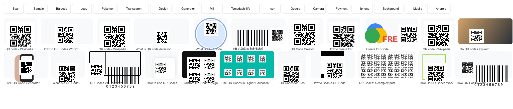
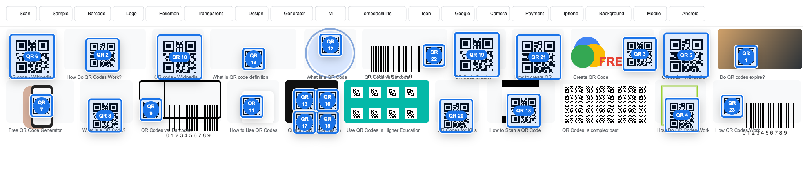

# QR Visual Regression

## User Prompt

Fix/improve the code until every single qr codes detected in this screenshot has the blue detected visual correctly on their location/size such that the QR Code is properly outlined without misalignment of the size/position. I gave you another screenshot without the qr code detected visuals. Use this exact screenshot as is in your test and your goal is to make sure every single qr code detected in the first ss is properly visualized when tested on the second ss.

Put this screenshots and prompt in an md file.

## Reference Screenshots

The raw upload bytes from the chat screenshots are not exposed as files in this workspace. This repo keeps a deterministic regression fixture that mirrors the provided Google Images screenshot layout and failure cases, including QR thumbnails near card edges, barcode neighbors, phone/photo thumbnails, and multi-QR cards.

Unmarked regression fixture:

Marked regression fixture after invoking the extension:

## Automated Coverage

The regression is implemented in `tests/fixtures/google-images-screenshot-grid.html` and validated by `tests/run-tests.mjs`.

The test opens the screenshot-like fixture at `2048x438`, invokes the extension, reads every expected QR bound from the fixture, and asserts that every detected blue visual has matching left/top/width/height within tolerance.
